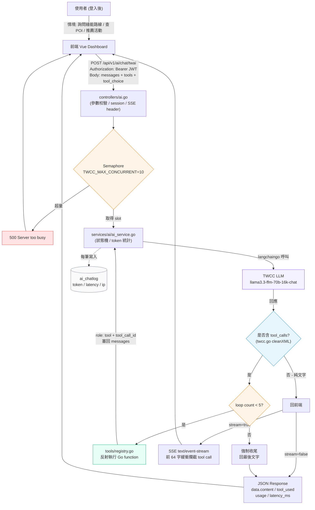

# TWCC AI Chat API - Tool Calling Flow

`POST /api/v1/ai/chat/twai`



## 輸入 (Request)

| 欄位 | 說明 |
|---|---|
| `Authorization` | `Bearer <JWT>`（需登入） |
| `messages` | `system / user / assistant / tool` 對話歷史 |
| `tools` | function schema 陣列（name / description / parameters） |
| `tool_choice` | `auto` / `none` / 指定函式 |
| `stream` | `true` 走 SSE，`false` 走 JSON |
| `temperature` / `top_p` / `top_k` / `max_new_tokens` / `seed` | 生成參數 |

## 輸出 (Response)

**非串流**

```json
{
  "status": "success",
  "data": {
    "content": "...",
    "tool_used": true,
    "session": "session_xxx",
    "model": "llama3.3-ffm-70b-16k-chat",
    "provider": "twcc",
    "latency_ms": 7176,
    "usage": { "input_tokens": 312, "output_tokens": 188, "total_tokens": 500 }
  }
}
```

**串流**：`text/event-stream`，前 64 字緩衝攔截 tool call，工具執行完才開始 stream 純文字。

## 限制

| 限制 | 來源 | 行為 |
|---|---|---|
| 並發 10 | `TWCC_MAX_CONCURRENT` Semaphore | 超量回 `500 Server too busy` |
| Tool loop 5 次 | `ai_service.go` 狀態機 | 超過強制收尾 |
| Timeout 60s | `TWCC_TIMEOUT` | 逾時報錯 |
| Retry 2 次 | `TWCC_MAX_RETRY`（僅非串流） | 自動重試 |
| SSE 前 64 字緩衝 | `providers/twcc/twcc.go` | 判斷 tool call 期間靜默 |

## 情境範例

1. **綠能路線**：使用者問「台北市府到新北市府的綠能路線」→ 模型呼叫 `get_eco_route` → 回填路線資料 → 模型生成自然語回覆。
2. **POI 查詢**：使用者問「附近的回收點」→ 模型呼叫 `search_recycle_poi` → 回 POI 清單。
3. **多輪 tool**：先 `get_user_location` → 再 `search_recycle_poi`（最多 5 輪）。
